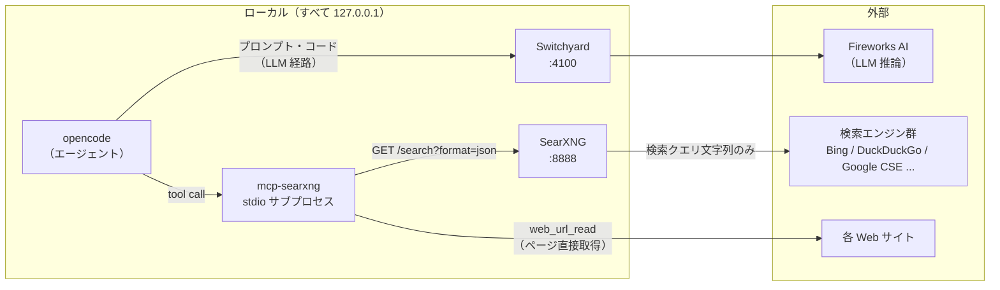
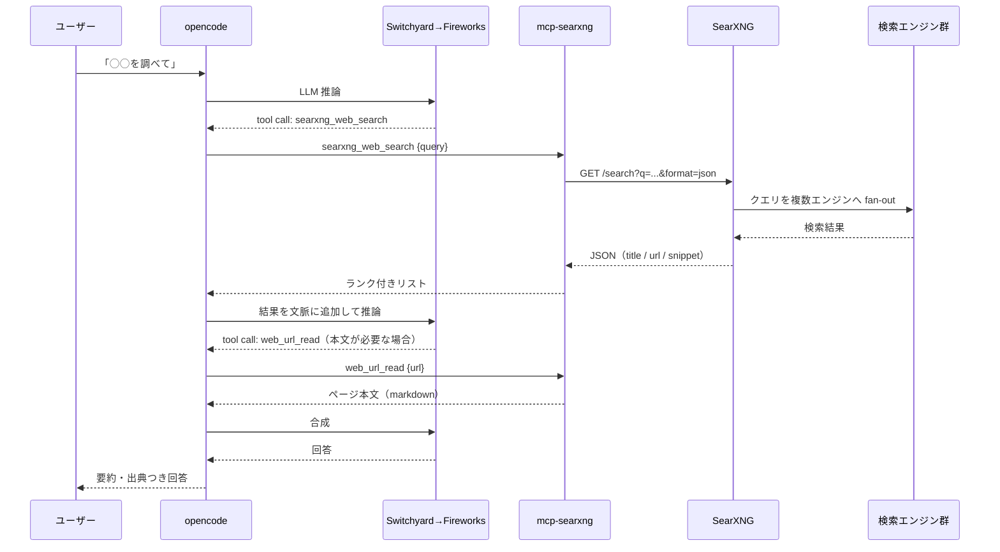

# web 検索の仕組みと仕様（SearXNG + mcp-searxng）

本バンドルの web 検索は、外部の検索 API キーを使わずにローカル完結で動きます。この文書はその仕組み・データフロー・仕様・運用をまとめたものです。セットアップ手順はトップの [README](../README.md) を参照してください。

## 背景

opencode 標準の `websearch` ツールは、検索クエリを外部のホステッド MCP（Exa / Parallel）へ認証なしで送信します。プライバシー強化設定（[opencode-with-strict-privacy](https://github.com/cm-dyoshikawa/opencode-with-strict-privacy/blob/main/README.ja.md)）ではこれを無効化するため、代替の検索経路が必要になります。

代替として OpenAI / Gemini の検索付き API を使う方法もありますが、メンバー全員に追加のキー払い出しが必要になります。本バンドルは検索の取得をローカルの SearXNG（キー不要のメタ検索エンジン）に任せ、要約・推論は既存の LLM 経路（Switchyard → Fireworks）が担うことで、**必要な外部キーを Fireworks 1 本に保ちます**。

## アーキテクチャ



構成要素は 3 つです。

| 構成要素      | 実体                                                                                                                                         | 役割                                                                      |
| ------------- | -------------------------------------------------------------------------------------------------------------------------------------------- | ------------------------------------------------------------------------- |
| SearXNG       | Docker コンテナ（`switchyard-searxng`、127.0.0.1:8888）                                                                                      | 複数の検索エンジンへクエリを fan-out し、結果を JSON で統合して返す       |
| mcp-searxng   | [ihor-sokoliuk/mcp-searxng](https://github.com/ihor-sokoliuk/mcp-searxng)。opencode が `bun x mcp-searxng` で自動起動する stdio サブプロセス | SearXNG の JSON API とページ取得を MCP ツールとしてエージェントに公開する |
| opencode 設定 | Global 設定の `mcp.searxng` ブロック（`opencode.jsonc.example` に同梱）                                                                      | 上記サブプロセスの起動定義と接続先 URL                                    |

## エージェントからの使われ方

opencode 起動時に mcp-searxng が自動起動し、エージェントに次のツールが生えます（ツール名には設定上のサーバー名 `searxng_` が接頭辞として付きます）。

| ツール               | 入力                      | 出力                                          |
| -------------------- | ------------------------- | --------------------------------------------- |
| `searxng_web_search` | `query`、`num_results` 等 | タイトル / URL / スニペットのランク付きリスト |
| `web_url_read`       | `url`                     | ページ本文を markdown 化したテキスト          |

完全なツールスキーマは mcp-searxng のリポジトリを参照してください。

利用は基本的にエージェントの自律判断です。「◯◯を調べて」のような発話に対し、モデルが必要と判断したときだけ検索が走ります。典型的な流れは次のとおりです。



確実に検索させたい場合は「searxng_web_search で調べて」と明示すれば、そのツールが使われます。

## データフローとプライバシー仕様

経路別に「外に出るもの」を固定しています。

| 経路       | 送信先                         | 出る内容                            | 出ない内容                     |
| ---------- | ------------------------------ | ----------------------------------- | ------------------------------ |
| LLM 推論   | Fireworks                      | プロンプト・コード                  | —                              |
| 検索       | 検索エンジン群（SearXNG 経由） | **検索クエリ文字列のみ**            | 会話・コード本文・ファイル内容 |
| ページ取得 | 対象 Web サイト                | 対象 URL への通常の HTTP リクエスト | 会話・コード本文               |

- 検索クエリのプロファイリングを行う中間事業者（ホステッド検索 API）は存在しません。SearXNG はローカルで動作し、クッキーやアカウントを持たずにエンジンへ問い合わせます
- 残余リスクはひとつだけ: **エージェントがクエリ文字列に含めた語は検索エンジンに届きます**。顧客名や未公開のコード名で直接検索させない、という通常の検索と同じ節度が必要です（軽減策は次節「推奨ルール」参照）
- `SEARXNG_SECRET` はローカルコンテナの内部用シークレットで、外部サービスの認証情報ではありません

## 推奨ルール（AGENTS.md）

前節の残余リスクは、エージェント向けのルールで軽減できます。opencode はプロジェクト直下の `AGENTS.md` と Global の `~/.config/opencode/AGENTS.md` をルールとして認識するため、Global 側に次の 2 行を追記しておくことを推奨します。

```markdown
- web 検索クエリには顧客名・社内プロジェクト名・未公開のコード名を含めない
- 検索は searxng_web_search を使い、結果の裏取りが必要なときだけ web_url_read で本文を読む
```

追記は必須ではありません。無くても動作とプライバシー構造は変わりませんが、クエリの節度をモデル側にも徹底できます。なお Global の `AGENTS.md` が存在しない場合、opencode は互換フォールバックとして `~/.claude/CLAUDE.md` をグローバルルールに読み込みます。Claude Code 用の個人設定を持っている場合は意図しない内容が opencode に流れ込むため、その点でも Global `AGENTS.md` を明示的に作っておく価値があります。

## SearXNG の設定仕様（`searxng/settings.yml`）

同梱の設定は最小オーバーライドで、load-bearing なのは次の 3 点です。

| 設定             | 値                                  | 理由                                                                                                                          |
| ---------------- | ----------------------------------- | ----------------------------------------------------------------------------------------------------------------------------- |
| `search.formats` | `[html, json]`                      | `json` が無いと `/search?format=json` が **403** を返す（デフォルトは html のみ）。許可外フォーマット（例: csv）は 403 のまま |
| `server.limiter` | `false`                             | limiter の bot 検知（link_token 方式）は API 直叩きを弾くため、ローカル私用では無効化する                                     |
| シークレット     | `SEARXNG_SECRET` 環境変数（`.env`） | settings.yml にシークレットをコミットしないため。`openssl rand -hex 32` で生成                                                |

JSON API のレスポンス主要フィールドは `query` / `results[]`（`url` / `title` / `content` / `score` / `engine`）/ `answers` / `suggestions` / `unresponsive_engines` です。

補足として `search.autocomplete: "duckduckgo"` も有効化しています。`searxng_search_suggestions` ツールが叩く `/autocompleter` エンドポイントの供給元で、SearXNG のデフォルト（無効）のままだとこのツールは常に空配列を返します。検索結果 JSON に付く `suggestions`（関連検索）とは別系統です。

## 運用

- 特定エンジンが `too many requests` を返しても、複数エンジンへの fan-out により他エンジンが結果をカバーします（`unresponsive_engines` で観測可能）。Google 系がもっとも制限が厳しく、Bing / DuckDuckGo は比較的安定という傾向があります
- セルフホスト SearXNG はデータセンター IP からだと bot 判定されやすいため、手元マシン（residential IP）での少量クエリ運用が前提です。共有サーバーへの集約デプロイは推奨しません
- 使うエンジンの選定・無効化・重み付けは、`searxng/settings.yml` に `engines:` セクションを足して調整できます（[SearXNG 公式ドキュメント](https://docs.searxng.org/admin/settings/settings_engines.html)参照）
- 検索を使わない場合は、opencode 設定の `mcp.searxng.enabled` を `false` にし、起動を `docker compose up -d --build switchyard` に変えます

## トラブルシュート

| 症状                                  | 原因と対処                                                                                                                                                                     |
| ------------------------------------- | ------------------------------------------------------------------------------------------------------------------------------------------------------------------------------ |
| `/search?format=json` が 403          | `searxng/settings.yml` の `search.formats` に `json` が無い。同梱の settings.yml がマウントされているか確認（`docker compose config` で volume を確認）                        |
| 検索ツールが opencode に生えない      | `bun`（または Node.js）が PATH に無く mcp-searxng を起動できていない。`bun x mcp-searxng` を手で実行して確認。Node 環境なら `command` を `["npx", "-y", "mcp-searxng"]` に変更 |
| 結果が 0 件・特定エンジンだけ失敗     | 一時的な rate limit。`unresponsive_engines` を確認し、頻発するエンジンは settings.yml で無効化                                                                                 |
| `searxng_search_suggestions` が空配列 | `search.autocomplete` が未設定（SearXNG デフォルトは無効）。同梱 settings.yml では `duckduckgo` で有効化済みのため、`git pull` 後に `docker compose restart searxng` で反映    |
| コンテナが起動しない                  | `.env` の `SEARXNG_SECRET` 未設定。README のセットアップ手順 2 のコマンドで生成・追記する                                                                                      |

## 検証記録

2026-07-24 に次を確認済みです。

1. format allowlist: `json` / `html` = 200、`csv` = 403
2. マルチエンジン fan-out: 一部エンジンが rate limit でも他エンジンが結果を返す（27〜43 件ヒット）
3. opencode 自律ループ: 「検索 → 公式リポジトリ特定 → `web_url_read` でページ取得 → 要約」を人手ゼロで完走
4. `SEARXNG_SECRET` の `.env` 注入と再作成後の動作
